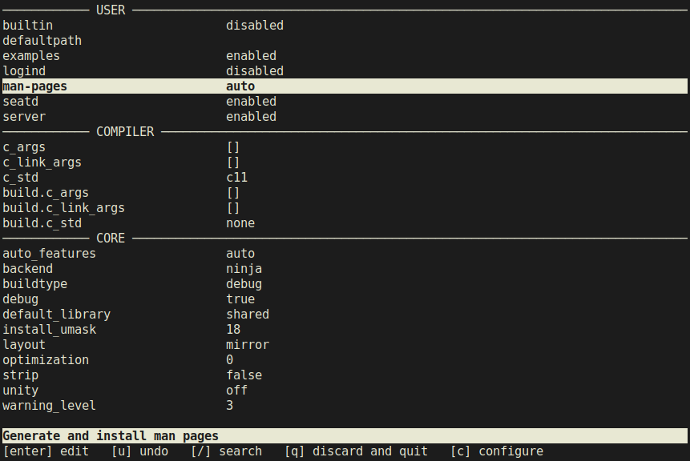

cmeson is a TUI for [meson](https://mesonbuild.com/) build system and offers a convenient, graphical way to configure build options instead of having to memorize them by heart and type them out in the terminal. The name and functionality of this application are derived from a similar application for [cmake](https://cmake.org/) ccmake. Anyway, a picture is worth a thousand words, so take a look at the image below.

# Installation

TODO

# Usage

	cmeson builddir
	cmeson [OPTIONS] builddir [sourcedir] [TRAILING]

	OPTIONS
		-h, --help               Show help message and exit
		--backend BACKEND        Select backend to query build options for

*sourcedir* is a directory containing meson.build file and *builddir* is the build directory for the project. *sourcedir* is only needed for projects for which *meson setup* has not been run yet and defaults to the current working directory if not specified.

The *--backend* option determined the list of options in the backend section and defaults to ninja. If you specify the backend using this option, you must not change the backend in TUI, as this will result in an error from meson. See the meson documentation for a complete list of supported backends.

If any trailing options are given, they are passed as-is to meson and are not interpreted by this application. Normally you do not need to specify any trailing options, as most of them can be configured directly through TUI.

# Todo

This application is already in a fully usable state, but there are still some small things missing:

- Write a man-page
- Tests
- grep -r -i TODO .

# License

MIT License
Copyright (c) 2021 Andrey Proskurin (proskur1n)

Permission is hereby granted, free of charge, to any person obtaining a copy
of this software and associated documentation files (the "Software"), to deal
in the Software without restriction, including without limitation the rights
to use, copy, modify, merge, publish, distribute, sublicense, and/or sell
copies of the Software, and to permit persons to whom the Software is
furnished to do so, subject to the following conditions:

The above copyright notice and this permission notice shall be included in all
copies or substantial portions of the Software.

THE SOFTWARE IS PROVIDED "AS IS", WITHOUT WARRANTY OF ANY KIND, EXPRESS OR
IMPLIED, INCLUDING BUT NOT LIMITED TO THE WARRANTIES OF MERCHANTABILITY,
FITNESS FOR A PARTICULAR PURPOSE AND NONINFRINGEMENT. IN NO EVENT SHALL THE
AUTHORS OR COPYRIGHT HOLDERS BE LIABLE FOR ANY CLAIM, DAMAGES OR OTHER
LIABILITY, WHETHER IN AN ACTION OF CONTRACT, TORT OR OTHERWISE, ARISING FROM,
OUT OF OR IN CONNECTION WITH THE SOFTWARE OR THE USE OR OTHER DEALINGS IN THE
SOFTWARE.